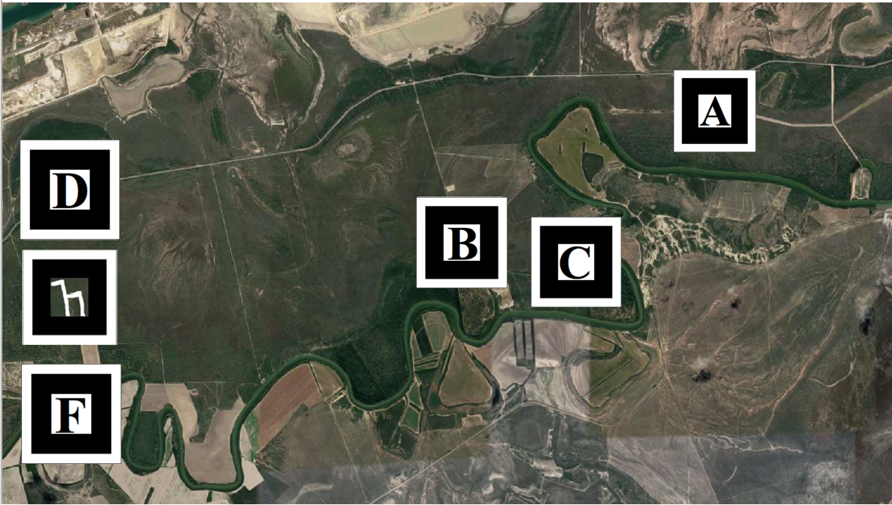

# BlocklyAR: A Visual Programming Interface for Creating Augmented Reality Experience

## Demo application
https://alex-nguyen.github.io/BlocklyAR/intro.html
## YouTube demo

## Please follow this image below for the testing marker: 

